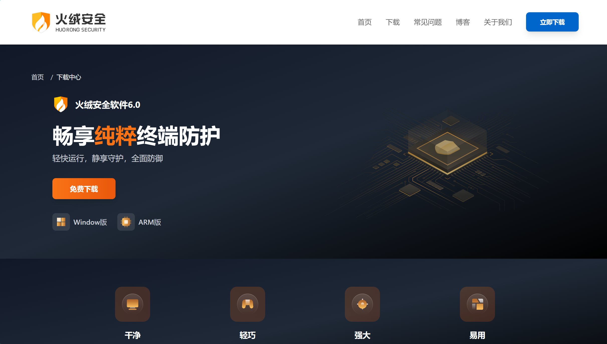
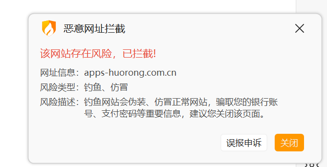
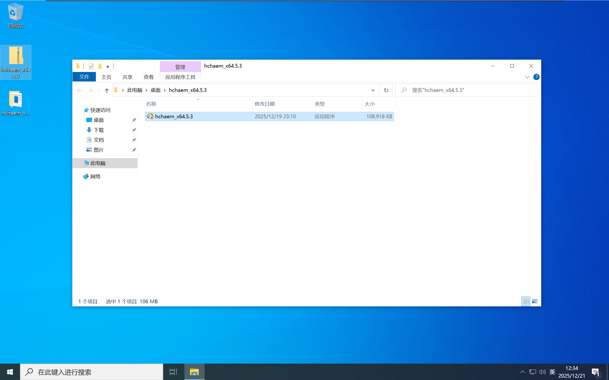
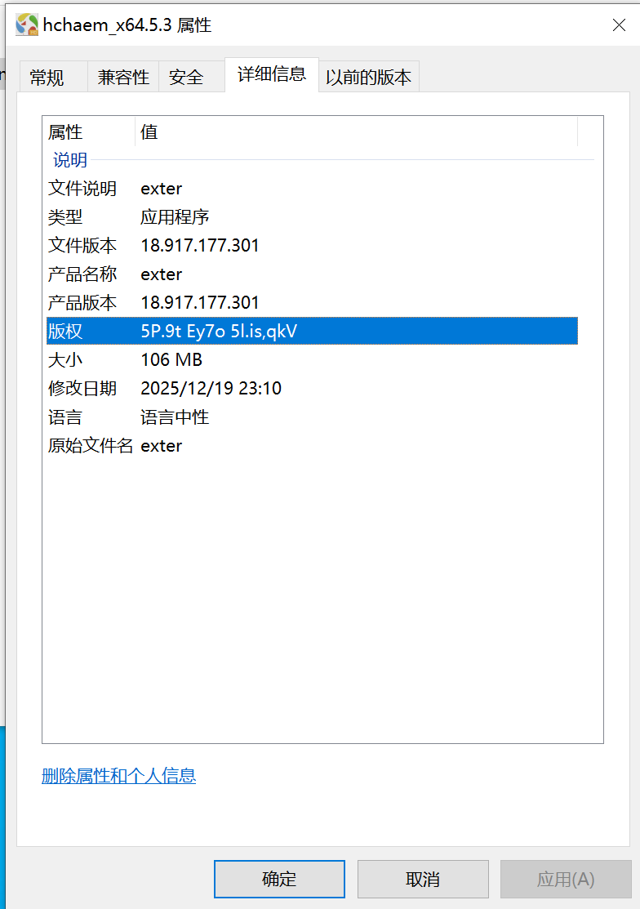
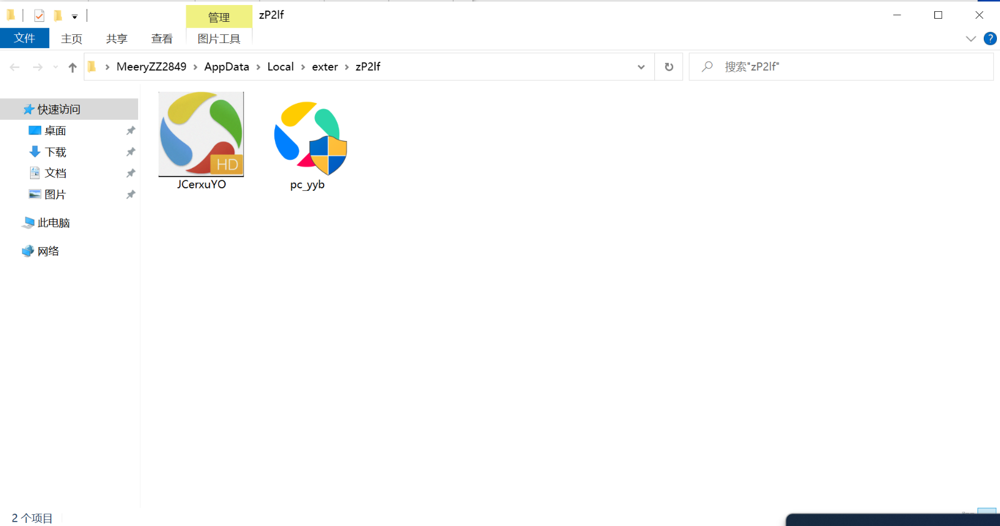
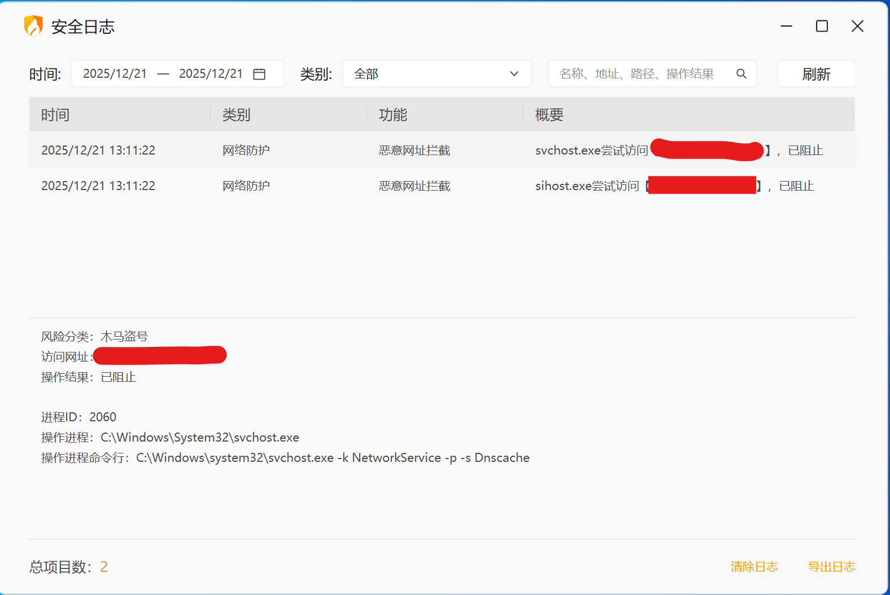
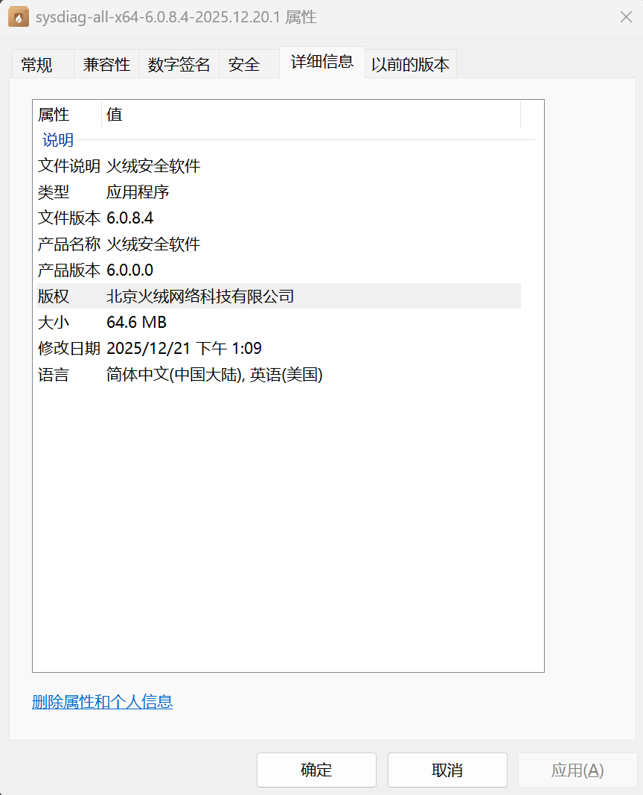

“干净、轻巧、强大、易用”，这些熟悉的标签出现在一个名为“火绒安全下载”的网站，吸引了无数寻找安全软件的用户。而在近日，某用户在网上发现了冒牌正版火绒安全的网站。

这个冒牌网站的域名是“apps-huorong.com.cn”，精心模仿了正版网站的设计和宣传语，迷惑性极强，但它的背后却暗藏着未知的危险。

注:如果您先前已安装过正版火绒安全，那么打开假火绒安全网站时将会被拦截

## 1.未知程序的特征

从“apps-huorong.com.cn”下载得到的文件名为"hchaem_x64.5.3.zip"压缩文件。解压后，将会得到“hchaem_x64.5.3.exe”可执行文件

从文件的详细信息可以看到，文件的版本，版权，文件说明等信息几乎都是瞎写的。文件的图标为“应用宝”的图标

PS:懒也有个限度吧，就这还敢来骗人😅

## 2.未知程序的行为

双击运行后，程序先弹出一个窗口，随后立刻消失。此时任务栏弹出安装程序图标，但没有窗口。程序安装完成后会在桌面生成名为“应用 宝”的快捷方式图标，随后鼠标转圈。

<video controls width="640" height="360">
  <source src="./images/1.mp4" type="video/mp4">
  您的浏览器不支持视频标签。
</video>

桌面的快捷方式指向"C:\Users\用户名\AppData\Local\exter\zP2lf\"目录中的正版”应用宝“安装包和一个图片文件

这里小编安装了“360杀毒软件”。可以看到，在整个安装过程中没有报错，没有疑似病毒的可疑进程，安装也顺利的完成了；但是，不管怎么双击360主程序，就是无法打开，在任务管理器中也没有360的任何进程

<video controls width="640" height="360">
  <source src="./images/2.mp4" type="video/mp4">
  您的浏览器不支持视频标签。
</video>

此时，如果你在中毒电脑中安装正版火绒安全，会弹出报毒窗口

那么，这个假冒的“火绒安全”这么危险，身为普通用户的我们应该如何下载和辨别真正的火绒安全？

## 3.如何获取正版火绒安全

1.请一定记住正版火绒安全的官网是“huorong.cn”

若是其他网站则一律为假

2.仔细观察下载文件的版权，文件说明和产品名称

正版火绒安全以其轻量化、无广告的特点著称，安装过程简单明了，不会捆绑其他软件或修改浏览器主页。任何偏离这些特点的“火绒安全”全部都是李鬼

## 4.总结

现在这种银狐木马已经大量泛滥，大家在下载软件的时候一定要擦亮眼睛，下载软件一定要看好官网，不要下载到盗版软件以及病毒程序。

最后附上微步云沙箱检测链接:[样本报告-微步在线云沙箱](https://s.threatbook.com/report/file/ee2fd14686781ef30f3a214144465587bc5a34a18dc24f2c43a5599f5c0b1118)